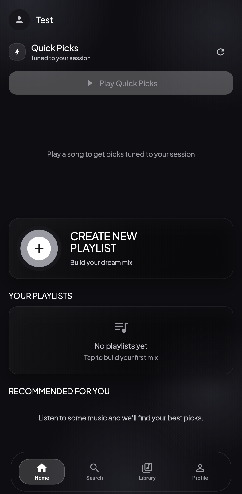
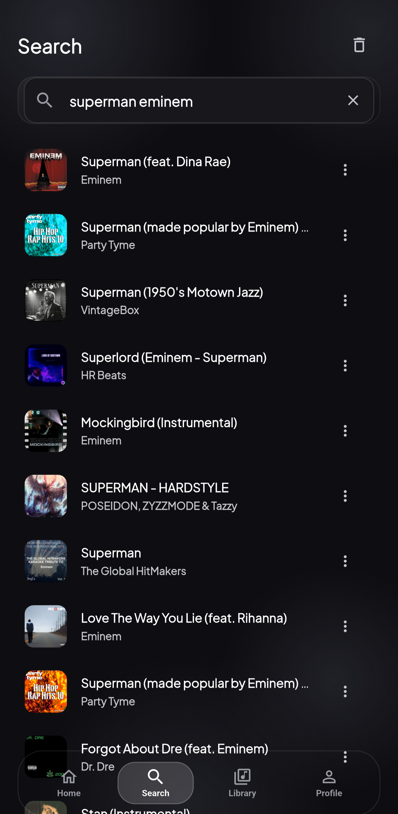
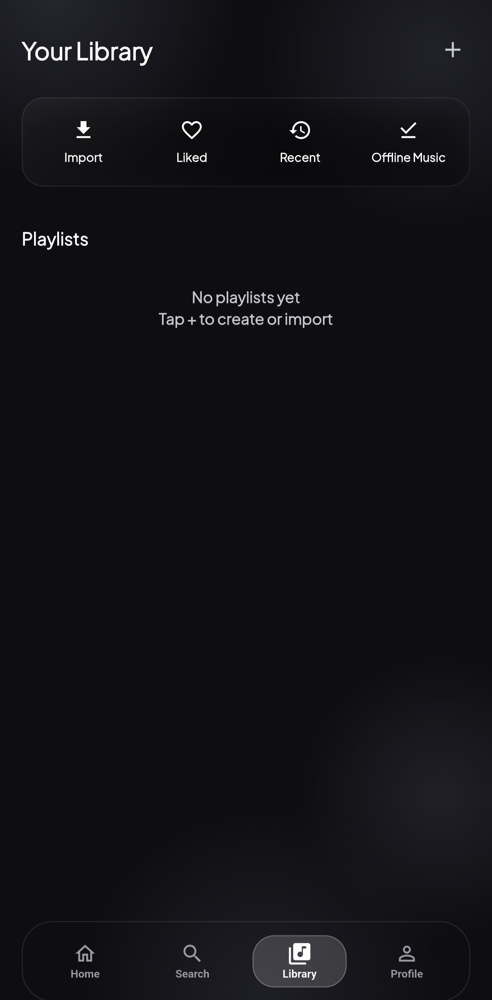
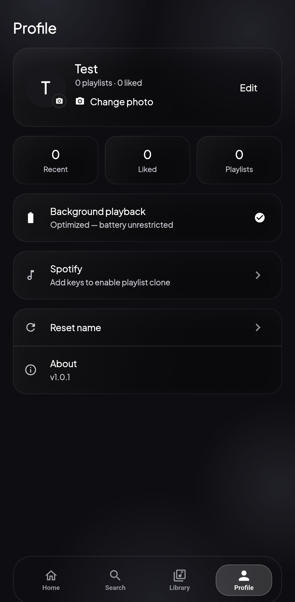
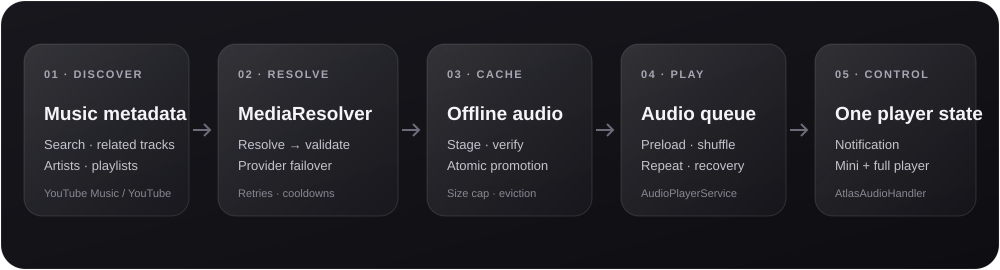

<div align="center">


# Atlas Music

### Your music. Your library. Your rules.

An open-source Android music player built with Flutter. Discover music, build playlists, follow synced lyrics, and keep listening offline—with a liquid-glass interface and background playback.

[](https://flutter.dev)
[](https://dart.dev)


[](LICENSE.md)
[](https://github.com/myLastNeuron/Atlas-Music/actions/workflows/ci.yml)

[Screens](#-screenshots) · [Features](#-features) · [Install](#-get-started) · [Architecture](#-how-it-works) · [Contribute](#-contributing)

<br />

</div>

> [!IMPORTANT]
> **Android only.** There is no iOS project in this repository, and iOS builds are not currently supported.

---

## 📱 Screenshots

<table align="center">
  <tr>
    <td align="center"><strong>HOME</strong><br /><a href="docs/media/home.png"></a></td>
    <td align="center"><strong>SEARCH</strong><br /><a href="docs/media/search.png"></a></td>
  </tr>
  <tr>
    <td align="center"><strong>LIBRARY</strong><br /><a href="docs/media/library.png"></a></td>
    <td align="center"><strong>PROFILE</strong><br /><a href="docs/media/profile.png"></a></td>
  </tr>
</table>

---

## ✨ Features

| Listen | Discover | Make it yours |
|---|---|---|
| Background playback with lock-screen and notification controls | Search across YouTube Music and YouTube video results | Playlists, liked songs, and listening history |
| Offline downloads with a validated, size-capped cache | Song-focused discovery, related tracks, and autoplay | Import playlists from YouTube, Spotify, or pasted track lists |
| Queue, shuffle, repeat, and preloading | On-device Quick Picks shaped by listening history and taste | Synced lyrics, line-by-line highlighting, and translation |
| Automatic provider failover and offline recovery | Artist pages and read-only video engagement stats | Dark liquid-glass design, animated backdrop, floating navigation |

### Playback that keeps going

- Audio continues with the screen off; the notification and in-app player share the same queue.
- Upcoming tracks are preloaded and validated before playback. When one source fails, Atlas can try another provider.
- Auto-play explores related songs, artist/title searches, and your own liked or recently played music.
- Downloads use an oldest-first cache capped at **1 GB** with a **7-day TTL**. The currently playing queue is protected from eviction.
- Quick Picks use on-device listening signals, with diversity controls and a short explanation for each pick.

### Lyrics, playlists & library

- Synced lyrics come from [LRCLIB](https://lrclib.net/) without an API key. Tap a line to seek; translate lyrics from the player.
- Create and edit playlists, add songs from search, change covers, and download a playlist for offline listening.
- Import YouTube / YouTube Music playlists, match Spotify playlists to playable tracks, or paste a track list.
- Spotify import uses **your own** Spotify API credentials. They are stored on-device; Atlas has no account or cloud-sync service.

### Discovery rules

Discovery filters out unknown-duration and non-music/long-form results. Songs in your own library and explicitly downloaded files are not removed by discovery filters. Search can still surface music uploads such as remixes, slowed versions, and lyric videos.

---

## 🚀 Get started

### Requirements

- Flutter stable (developed with Flutter **3.47.2** and Dart 3)
- Android Studio or Android SDK + JDK
- Android device/emulator running **Android 7.0 (API 24)** or newer

### Run locally

```bash
git clone https://github.com/myLastNeuron/Atlas-Music.git
cd Atlas-Music
flutter pub get
flutter run
```

`audio_service` is intentionally vendored at `plugins/audio_service` and wired through a local dependency override. Keep it in place for Android builds.

### Build an APK

```bash
# Universal APK
flutter build apk --release

# Smaller per-architecture APKs
flutter build apk --release --split-per-abi
```

Artifacts are written to `build/app/outputs/flutter-apk/`.

### Sign a release

Without signing configuration, release builds use the machine's debug keystore. This is fine for local testing, but APKs signed on different machines cannot update each other. To publish update-compatible builds, create a private keystore:

```bash
keytool -genkey -v -keystore android/app/atlas-release.jks \
  -keyalg RSA -keysize 2048 -validity 10000 -alias atlas
```

Create `android/key.properties` (both files are git-ignored):

```properties
storePassword=<your store password>
keyPassword=<your key password>
keyAlias=atlas
storeFile=atlas-release.jks
```

Back up the keystore and passwords securely. Losing them means you cannot sign updates for existing installs.

---

## 🧭 How it works

<div align="center">

</div>

1. **Metadata:** `YouTubeService` handles search, related tracks, artist data, and playlist imports.
2. **Resolve:** `MediaResolver` implementations find and validate playable streams; `ResolverStrategy` handles provider order, retries, and cooldowns.
3. **Cache:** `CacheService` stages downloads, validates them, promotes them atomically, and enforces the cache limit.
4. **Play:** `AudioPlayerService` owns the queue, shuffle/repeat behavior, preloading, offline recovery, and downloads.
5. **Sync:** `AtlasAudioHandler` bridges playback to Android media controls; screens listen to the shared player state.

### Stack

- **App:** Flutter + Dart, Provider
- **Audio:** `just_audio`, `audio_session`, vendored `audio_service`
- **Metadata & streams:** YouTube Music / InnerTube and `youtube_explode_dart`
- **Lyrics:** LRCLIB; Google Translate for lyric translation
- **Local data:** `shared_preferences`, on-device files
- **UI:** Plus Jakarta Sans, custom liquid-glass surfaces and motion

---

## 🗂️ Project map

```text
lib/
├── main.dart, app.dart       # Startup, providers, navigation shell
├── media/                    # Resolver contract, provider chain, offline cache
├── models/                   # Song, playlist, artist, video stats
├── screens/                  # Home, search, library, player, profile, …
├── services/                 # Playback, YouTube, lyrics, storage, recommendations
├── theme/                    # Colors, typography, motion, shared theme
└── widgets/                  # Mini-player, lyrics, artwork, glass navigation
plugins/audio_service/        # Vendored audio_service Android implementation
docs/media/                   # App screenshots and architecture illustration
```

---

## 🧪 Checks

```bash
flutter analyze
flutter test
```

The same checks run in GitHub Actions. Tests cover content filtering, recommendations, cache/download policy, resolver failover, lyrics, playlist parsing, storage, and UI helpers. The vendored `plugins/audio_service` copy is excluded from project analysis.

---

## 🗺️ Current limits

- Android only; iOS support has not started.
- No queue-reordering screen or playback position restore after restarting the app.
- No cloud sync or user accounts; library data stays on-device.
- The dark appearance is fixed; there is no theme switcher.
- YouTube does not generally publish dislike counts, so unavailable values appear as N/A.

---

## 🤝 Contributing

1. Fork the repository and create a branch.
2. Make your change and add/update tests where appropriate.
3. Run `flutter analyze` and `flutter test`.
4. Open a pull request with a short description and test results.

Issues and pull requests are welcome. Please keep platform claims accurate: **Android is the only supported target today.**

## 📄 License & disclaimer

Atlas Music is licensed under the [Apache License 2.0](LICENSE.md).

This is a mostly AI-generated learning project and has **not** had a formal security audit. It is provided without warranty. YouTube's Terms of Service may restrict direct audio extraction; use the app responsibly and follow the terms and laws that apply to you.

---

<div align="center">

If Atlas Music is useful to you, consider giving the project a ⭐

Made with Flutter · built for the love of music

</div>
